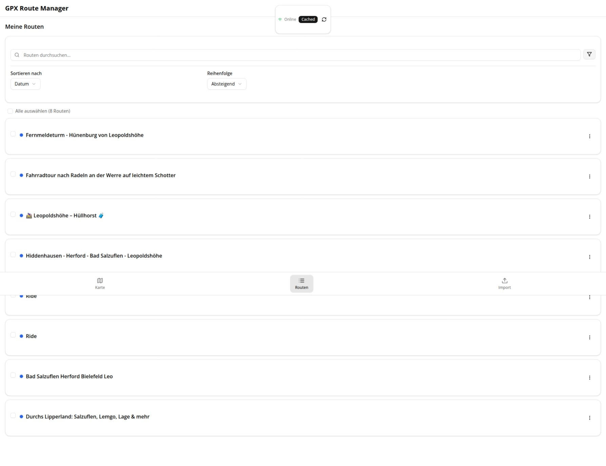

<p align="right">
  <a href="./README.md" title="English"> English</a> |
  <a href="./README.de.md" title="Deutsch"> Deutsch</a>
</p>

# GPX Route Manager PWA

Diese Anwendung bündelt mehrere GPX-Dateien von Fahrrad-Navis oder Exporten aus Diensten wie Komoot oder Strava und stellt sie auf einer Karte dar. Identische Routen werden zusammengeführt und nur einmal angezeigt. Routen können ein-/ausgeblendet, farblich markiert und sortiert werden.

<p align="center">
  
  
</p>

<p align="center">
  <a href="https://skillicons.dev">
    
  </a>
</p>

## Funktionen
- Import mehrerer GPX-Dateien, Zusammenführung identischer Tracks.
- Sichtbarkeit, Farbcodierung und Sortierung pro Route.
- PWA: installierbar, offline nutzbar, sauberer Cache mit Fallback.
- Schnelles GPX-Parsing im Web-Worker (fast-xml-parser).
- Persistenz über IndexedDB/OPFS; Export/Import (JSON/GPX/ZIP).

## Voraussetzungen
- Node.js ≥ 20
- npm oder pnpm
- Git (optional)

## Installation
```bash
cd ~/Downloads/gpx-pwa
npm install
# alternativ: pnpm install
```

## Entwicklung
```bash
npm run dev
# bei Port-Konflikt:
PORT=3001 npm run dev
# pnpm:
# pnpm run dev
# PORT=3001 pnpm run dev
```

## Produktion
```bash
npm run build
npm run start
# bei Port-Konflikt:
# PORT=3001 npm run start
# pnpm:
# pnpm run build && pnpm run start
# PORT=3001 pnpm run start
```

## Web-Worker
Parser in `lib/gpx/parse.worker.ts`. Bundling nach `public/parse.worker.js` via `predev`/`prebuild`.

```bash
npx esbuild lib/gpx/parse.worker.ts --bundle --format=esm --outfile=public/parse.worker.js --platform=browser
# pnpm:
# pnpm exec esbuild lib/gpx/parse.worker.ts --bundle --format=esm --outfile=public/parse.worker.js --platform=browser
```

## Service Worker
Registrierung über `/api/sw`. In Entwicklung ohne Cache für `/_next` und `/api`. Offline-Fallback unter `/_offline`.

## Fehlerseiten
- `app/error.tsx`
- `app/global-error.tsx`
- `app/not-found.tsx`

## .gitignore
Empfohlen: `node_modules/`, `.next/`, `.env*`, `public/parse.worker.js`.

## Setup-Skript
```bash
./scripts/setup.sh
```
