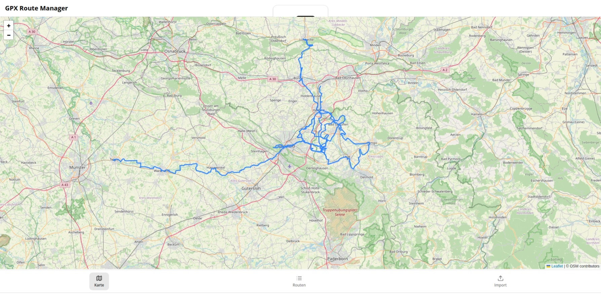
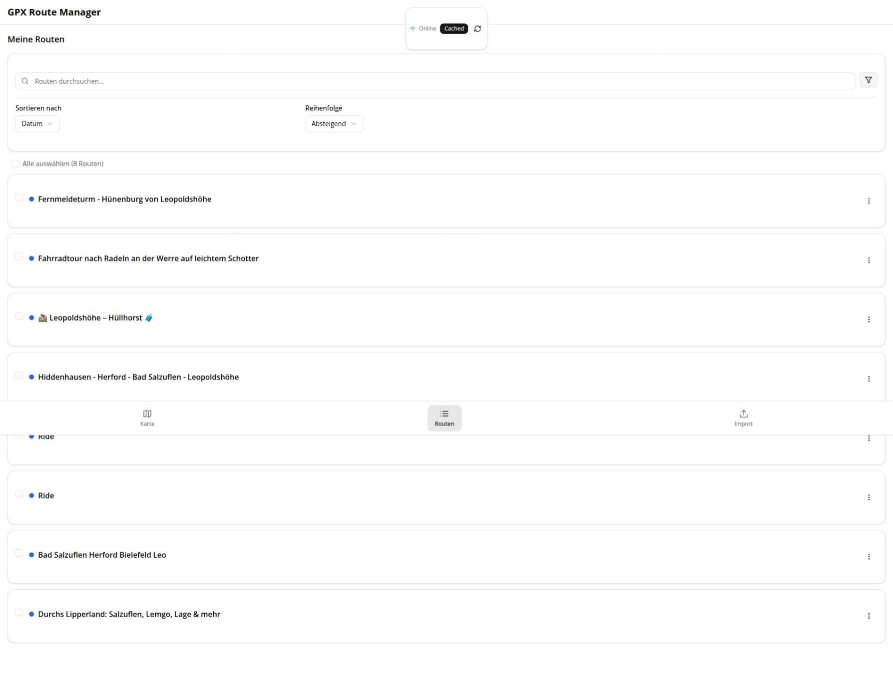

# GPX Route Manager PWA

Dieses Projekt ist eine Next.js-14.2.32-Anwendung zur Verwaltung von GPX-Routen.  
Beispielpfad: `~/Downloads/gpx-pwa`.

<p align="center">
  
  
</p>

## Voraussetzungen

- Node.js ≥ 20
- npm (Standard) oder pnpm
- Git (optional)

## Installation

```bash
cd ~/Downloads/gpx-pwa
npm install
```

Mit pnpm:

```bash
pnpm install
```

## Web-Worker

Der GPX-Parser befindet sich in `lib/gpx/parse.worker.ts` und nutzt `fast-xml-parser` ohne DOMParser:

```ts
import { XMLParser } from "fast-xml-parser"

type InMsg = {
  id: string
  type: "parse-gpx"
  data: { content: string; filename: string; options: any }
}

type OutOk = { id: string; type: "parse-success"; data: { routes: any[] } }
type OutErr = { id: string; type: "parse-error"; data: { error: string } }

const parser = new XMLParser({
  ignoreAttributes: false,
  attributeNamePrefix: "@_",
  trimValues: true,
})

self.onmessage = (e: MessageEvent<InMsg>) => {
  const { id, type, data } = e.data
  if (type !== "parse-gpx") return

  try {
    const obj = parser.parse(data.content)
    const gpx = obj.gpx ?? obj.GPX ?? obj

    const tracks: any[] = []
    if (gpx?.trk) {
      const trks = Array.isArray(gpx.trk) ? gpx.trk : [gpx.trk]
      for (const trk of trks) {
        const name = trk.name ?? data.filename
        const segs = trk.trkseg ? (Array.isArray(trk.trkseg) ? trk.trkseg : [trk.trkseg]) : []
        const points: any[] = []

        for (const seg of segs) {
          const pts = seg.trkpt ? (Array.isArray(seg.trkpt) ? seg.trkpt : [seg.trkpt]) : []
          for (const p of pts) {
            const lat = Number(p["@_lat"])
            const lon = Number(p["@_lon"])
            const ele = p.ele !== undefined ? Number(p.ele) : undefined
            const time = p.time
            if (Number.isFinite(lat) && Number.isFinite(lon)) {
              points.push({ lat, lon, ele, time })
            }
          }
        }

        tracks.push({ id: `${id}:${tracks.length}`, name, points })
      }
    }

    ;(self as any).postMessage({ id, type: "parse-success", data: { routes: tracks } } as OutOk)
  } catch (err: any) {
    ;(self as any).postMessage({ id, type: "parse-error", data: { error: err?.message || String(err) } } as OutErr)
  }
}
```

Der Worker wird mit esbuild nach `public/parse.worker.js` gebündelt:

```bash
npx esbuild lib/gpx/parse.worker.ts --bundle --format=esm --outfile=public/parse.worker.js --platform=browser
```

Mit pnpm:

```bash
pnpm exec esbuild lib/gpx/parse.worker.ts --bundle --format=esm --outfile=public/parse.worker.js --platform=browser
```

Die Skripte `predev` und `prebuild` in `package.json` führen diesen Befehl automatisch aus.

## Service Worker

Der Service Worker wird über `/api/sw` registriert. Er ist für die Entwicklung sicher und cached keine Pfade unter `/_next` oder `/api`.

## Fehlerseiten

- `app/error.tsx`
- `app/global-error.tsx`
- `app/not-found.tsx`

## Starten

Entwicklung:

```bash
npm run dev
```

Port-Konflikt:

```bash
PORT=3001 npm run dev
```

Mit pnpm:

```bash
pnpm run dev
PORT=3001 pnpm run dev
```

Produktion:

```bash
npm run build
npm run start
```

Port-Konflikt:

```bash
PORT=3001 npm run start
```

Mit pnpm:

```bash
pnpm run build
pnpm run start
PORT=3001 pnpm run start
```

## .gitignore

Empfohlen: `node_modules/`, `.next/`, `.env*`, `public/parse.worker.js`.

## Setup-Skript

Alternativ kann die Einrichtung über das Skript erfolgen:

```bash
./scripts/setup.sh
```
